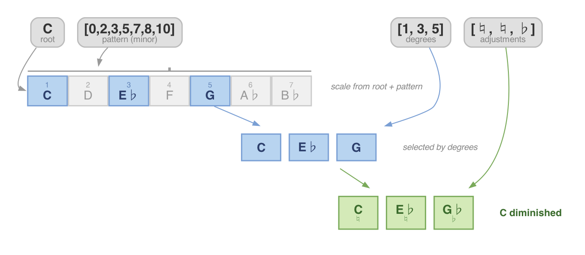
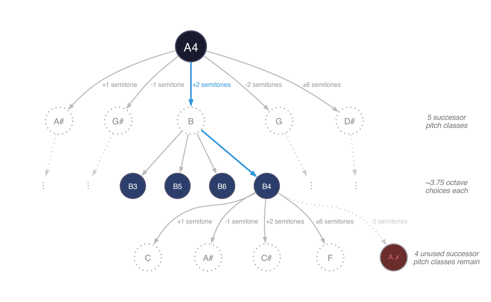
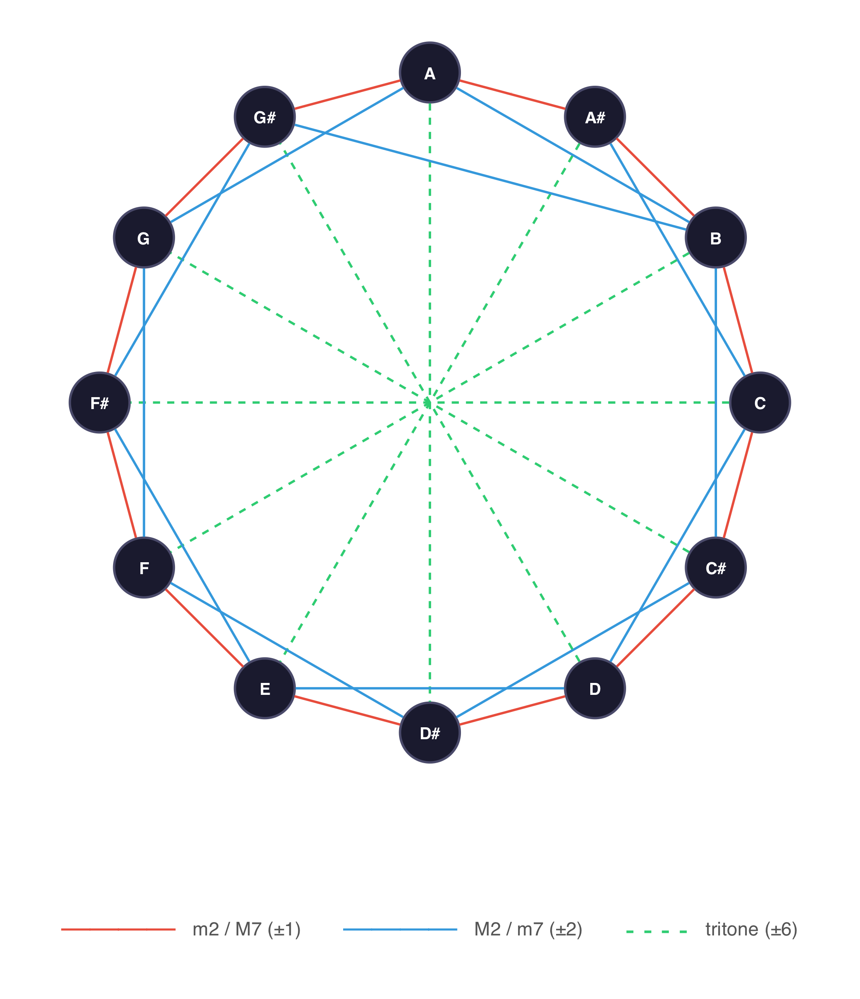

# jazz-engine

Prolog implementation of music theory & jazz guitar.


## Usage

### Notes

The `note` record is defined as:

```prolog
record note(name:atom, accidental:atom=natural, octave:integer=4).
```

Use the `mk_note(Name, Note)`, `mk_note(Name, Accidental, Note)`, or `mk_note(Name, Accidental, Octave, Note)`
to create a new note variable. Alternatively, you can use the literal syntax:

```prolog
note{name: c, accidental: natural, octave: 4}
```

Pretty print a list of notes using `pretty_print/1`.

#### Sharps and Flats

The `sharp/2` predicate raises a note by a semitone. The `flat/2` predicate behaves in a similar way.

To normalize a note from potential flat to sharp/natural only, use `sharpify_flats/2`.

#### Enharmonics

Two notes are enharmonic if they share the same pitch. The predicate `enharmonic/2` captures this.

### Intervals

The `interval/3` predicate is defined as:

```prolog
interval(First, Second, Semitones) :- ...
```

It uses a lookup table of all notes (in sharpified form) to compute the distance between the indices of the given notes. 

Interval names are available using the `interval_name/2` predicate. 

**Example: Using `interval/3` to find the distance between notes**

Query:
```
?- mk_note(c, natural, 4, C4), 
   mk_note(e, flat, 4, E_flat), 
   interval(C4, E_flat, Semitones), 
   interval_name(Semitones, IntervalName).
```
Output:
```
C4 = note{accidental:natural, name:c, octave:4},
E_flat = note{accidental:flat, name:e, octave:4},
Semitones = 3,
IntervalName = minor_third.
```

<p align="center">

</p>

**Example: Using `interval/3` to find the note a given distance away**

Query:
```
?- mk_note(c, Root), interval_name(Semitones, minor_third), interval(Root, SecondNote, Semitones).
```
Output:
```
Root = note{accidental:natural, name:c, octave:4},
Semitones = 3,
SecondNote = note{accidental:sharp, name:d, octave:4}.
```

<p align="center">

</p>

Notice that the same `interval/3` predicate handles both directions — given two notes it computes the distance, and given one note and a distance it finds the other note. Prolog's built-in search eliminates the need for separate forward and backward implementations.

### Scales

There are two important concepts in scales. 

A *pattern* is the set of intervals that makes up the scale.
For example, a major scale has the pattern "whole, whole, half, whole, whole, whole, half",
or-- expressed as semitones above the tonic, `[0, 2, 4, 5, 7, 9, 11]`.
This pattern is available as `major_scale_pattern/1`. There is also `minor_scale_pattern/1`.

A *scale degree* is an array index into a scale. The Nth scale degree in a given key is the Nth note of that scale. 
The `scale_degree/4` predicate works like this:

```prolog
scale_degree(Tonic, Pattern, Degree, Note) :-
    nth1(Degree, Pattern, Interval),
    interval(Tonic, Note, Interval).
```

The shortcut `major_scale_degree/3` is also provided, eliminating the `Pattern` argument.

The `scale/3` primitive generates degrees 1 through 7 in a given pattern, starting with a given tonic:

```prolog
scale(Tonic, Pattern, Notes) :-  % generates list of intervals above tonic, by scale degree
    betweenToList(1,7,Degrees),
    maplist(\Degree^Note^(
        scale_degree(Tonic, Pattern, Degree, Note)
    ), Degrees, Notes).
```

The shortcuts `major_scale/2` and `minor_scale/2` are also provided, eliminating the `Pattern` argument.

**Example: Generating a D major scale:**

Query:
```
?- mk_note(d, Tonic), major_scale(Tonic, Notes), pretty_print(Notes).
```

Output (manually formatted for readability; `pretty_print` result is the first line):
```
d_natural_4 e_natural_4 f_sharp_4 g_natural_4 a_natural_5 b_natural_5 c_sharp_5 
Tonic = note{accidental:natural, name:d, octave:4},
Notes = [
   note{accidental:natural, name:d, octave:4}, 
   note{accidental:natural, name:e, octave:4}, 
   note{accidental:sharp, name:f, octave:4}, 
   note{accidental:natural, name:g, octave:4}, 
   note{accidental:natural, name:a, octave:5}, 
   note{accidental:natural, name:b, octave:5}, 
   note{accidental:sharp, name:c, octave:5}
].
```

### Chords

The `chord` record type is defined as:

```prolog
:- record chord(root:note, pattern:list, degrees:list, adjustments:list).
```

`degrees` represents a list of scale degrees making up the chord, *starting from the givn `root` note of the chord as `1`*.

The `pattern` and `adjustments` arguments can be combined in flexible ways to produce different chords. 
The scale `degrees` making up the chord will be mapped onto the provided `pattern`,
so using a minor pattern with no `adjustments` will yield a minor chord. 
The `adjustments` are applied after this, and can be used to reference tones outside the key. 
For example, to represent a diminished chord, we would request scale degrees `[1, 3, 5]`, a minor pattern,
and the adjustments `[natural, natural, flat]`. This will yield a tonic (1), a minor third (m3) from the pattern, 
and a diminished fifth (b5) from the `flat` adjustment applied on the top note.

This is a very flexible system, for example it is possible to create a minor chord at least two ways:

```
chord{root: _, pattern: <minor pattern>, degrees: [1, 3, 5], adjustments: [natural, natural, natural]}
chord{root: _, pattern: <major pattern>, degrees: [1, 3, 5], adjustments: [natural, flat, natural]}
```

<p align="center">

</p>

#### Available Chord Shortcuts:

| Shortcut | Pattern | Degrees | Adjustments |
|----------|---------|---------|-------------|
| `major_chord/2` | major | [1, 3, 5] | [♮, ♮, ♮] |
| `minor_chord/2` | minor | [1, 3, 5] | [♮, ♮, ♮] |
| `diminished_chord/2` | minor | [1, 3, 5] | [♮, ♮, ♭] |
| `augmented_chord/2` | major | [1, 3, 5] | [♮, ♮, ♯] |
| `major_minor_major_7_chord/2` | major | [1, 3, 5, 7] | [♮, ♮, ♮, ♮] |
| `sus2_chord/2` | major | [1, 2, 5] | [♮, ♮, ♮] |
| `sus4_chord/2` | major | [1, 4, 5] | [♮, ♮, ♮] |
| `nine_sus4_chord/2` | major | [1, 4, 5, 2] | [♮, ♮, ♮, ♮] |

### Chord Notes

The `chord_notes/2` primitive converts between a chord and a set of notes.

**Example: Building a chord with `major_chord/2` and getting the notes with `chord_notes/2`:**

Query:
```
?- mk_note(c, Root), major_chord(C, Chord), chord_notes(Chord, Notes), pretty_print(Notes).
```

Output (manually formatted for readability) -- the `pretty_print` is the first line:
```
c_natural_4 e_natural_4 g_natural_4 
Root = note{accidental:natural, name:c, octave:4},
Chord = chord{adjustments:[natural, natural, natural], 
              degrees:[1, 3, 5], 
              pattern:[0, 2, 4, 5, 7, 9, 11], 
              root:note{accidental:natural, name:c, octave:4}},
Notes = [note{accidental:natural, name:c, octave:4}, 
         note{accidental:natural, name:e, octave:4}, 
         note{accidental:natural, name:g, octave:4}] .
```


### Chord Progressions

The `chord_progression/4` predicate has the signature:

```prolog
chord_progression(Tonic, Pattern, Degrees, Chords)
```

**Example: Creating a I-vi-ii-V chord progression in G:**

Query:
```
?- mk_note(g, Tonic), major_scale_pattern(Pattern), chord_progression(Tonic, Pattern, [1, 6, 2, 5], Chords).
```

Output (manually formatted for readability):
```
Tonic = note{accidental:natural, name:g, octave:4},
Pattern = [0, 2, 4, 5, 7, 9, 11],
Chords = [
   chord{adjustments:[natural, natural, natural], 
         degrees:[1, 3, 5], 
         pattern:[0, 2, 4, 5, 7, 9, 11], 
         root:note{accidental:natural, name:g, 
         octave:4}}, 
   chord{adjustments:[natural, natural, natural], 
         degrees:[1, 3, 5], 
         pattern:[0, 2, 4, 5, 7, 9|...], 
         root:note{accidental:natural, name:e, 
         octave:5}}, 
   chord{adjustments:[natural, natural, natural], 
         degrees:[1, 3, 5], 
         pattern:[0, 2, 4, 5, 7|...], 
         root:note{accidental:natural, 
         name:a, 
         octave:5}}, 
   chord{adjustments:[natural, natural, natural], 
         degrees:[1, 3, 5], 
         pattern:[0, 2, 4, 5|...], 
         root:note{accidental:natural, 
         name:d, 
         octave:5}}
].
```

# The Angry Man


Composition by Steve Dukes, whose rules are implemented here.

Predicates can be found in `angry_man.pl`.

#### 12-Tone Rows

A Tone Row is a permutation of the 12 basic notes, with unbound octave values:

```prolog
tone_row_mk_12_unbound_notes(Notes) :-
    Notes = [
        note{name: a, accidental: natural, octave: _},
        note{name: a, accidental: sharp, octave: _},
        ...
    ].


tone_row(Notes) :-
    tone_row_mk_12_unbound_notes(TwelveUnboundNotes),
    permutation(TwelveUnboundNotes, PermutedNotes),
    Notes = PermutedNotes.
```

The provided helper predicate `unique_tones/1` holds if the tones within a given list of notes
are unique (ignoring octave).

The Angry Man intervals are:

```prolog
angry_man_interval_names([
    minor_second,
    major_second,
    tritone,
    minor_seventh,
    major_seventh
]).
```

These are available as semitone counts in `angry_man_intervals/1`.

The predicate `angry_man_next_note/2` accepts a list and a note.
This predicate holds if the given note "fits" as a next note in an Angry Man tone row.

A note fits if it is either the first note in the row,
or it is a second note and it is one of the above intervals away from the first note,
or if it is a new (unique) tone and forms an Angry Man interval with the previous note.

The `angry_man_row/1` predicate is intended to *verify* if a tone row is a valid Angry Man row.
An experimental implementation `exp_angry_man_row/1` may be much more efficient. 

The predicate `the_angry_man/2` (variables are `ToneRows` and `Length`) is supposed to
generate all tone rows satisfying the constraints of the composition.

<bold>
Some of The Angry Man predicates do not work as expected for rows longer than 5 notes.
This is a known issue and work-in-progress.
</bold>

### The Angry Man: Analysis

Let's dive into the numbers.

The number of permutations without repetition $\_nP\_r$ read as "$`n`$ options pick $`r`$" is given by the formula:

$$
\text{Possible permutations} 
= {\_nP\_r} 
= \frac{n!}{(n-r)!}
$$

In our case, there are 45 notes on the Martin DC-45. 
Each tone row has 12 tones.
So, the number of possible 12-tone rows on the guitar is given by

$$\text{Possible 12-tone rows} = {\_{45}P\_{12}} = \frac{45!}{(45-12)!} \approx 1.377 × 10^{19}$$

This is around 13 quintillion, or 13 billion billion possible combinations.

However, in this composition, there are more constraints.
Let's work backwards to the definition of a permutation in order to more
      easily introduce these constraints to the equation
      without having to deal with factorials.

Given a set of notes $E$ already in the tone row,
      let the set $N$ represent the possible next notes.

An upper bound for the number of options $|N|$ 
      is given by the number of remaining available tones.
Since each tone is only used once,
      at each decision point there are at most $45 - |E|$ choices remaining.

Following this logic we can re-write the permutations formula as

$$
{\_nP\_r} = 
\prod
      \_{i = 0}^{r - 1}
      (n - i)
$$

In our case, it yields the same result:

$$
{\_{45}P\_{12}} 
= \prod
      \_{i = 0}^{11}
      (45 - i)
\approx 1.377 × 10^{19}
$$

There are 5 vaild intervals between each note in The Angry Man's tone rows.

At each step, an option is invalid if there is already a note
      with the same tone (note name and accidental, don't care about octave).

Let's estimate this as the number of notes already in the row,
      multiplied by the expected probability that a given note will
      fall one of the accepted intervals away from a given note.

From any given note, there are 5 unique successor tones
      (as explained in the next section).
For each successor tone,
      there are about $45/12 = 3.75$ octaves in which it could fall,
      meaning each note really has about
      $5 * 3.75 \approx 19$ valid options for a next note.
So, the probability of a given note being a valid interval away from another
      note is about $19/45 \approx 41.7\%$.

<p align="center">

</p>

Assuming an even distribution of tones in the guitar's range,
      the number of choices $|N|$ at each stage
      (given the existing row $E$)
      is now estimated by the following equation:

$$
|N| \approx
\left\[
45
\-
\underbrace{|E| * \frac{45}{12}}\_{\text{Already used}}
~
\right\]
*
\underbrace{\frac{5 * 3.75}{45}}\_{\text{Avg probability of valid interval}}
$$

In the case of our tone rows, $|E|$ is given by the iteration variable
      $i$ at each step.

Simplifying yields the following estimate for the total number
      of possible Angry Man tone rows:

$$
\text{Angry Man rows}
\approx \prod
      \_{i = 0}
      ^{11}
      \left\[
      \left(45 - i * \frac{45}{12}\right)
      *
      0.41\bar6
      \right\]
\approx
1.01 × 10^{11}
$$

This gives us about 101 billion possible Angry Man tone rows.

That number is still based on a big hidden assumption:
      the probability of picking a valid (right interval away) note
      out of the possible options remains constant as the tone row
      grows.
In other words, it's possible that as we pick more notes,
      it becomes either harder or easier to find notes that are a valid
      interval away. This *likely* depends on which notes we pick.

To get past this assumption, we need a different strategy —
      one that accounts for the actual structure of which tones
      connect to which, rather than averaging over all possibilities.
It turns out the code already encodes everything we need.

### The Angry Man: Exact Count

#### Separating pitch classes from octaves

A key insight emerges from the code structure.
The `angry_man_build` predicate checks two independent things
      for each candidate note:

1. **Pitch-class constraint**: consecutive notes must have pitch classes
      connected by an angry man interval
      (checked via `angry_man_candidate`, which uses `angry_successor_pc`)
2. **Uniqueness constraint**: each pitch class (name + accidental)
      must appear at most once
      (checked via `\+ member(Name-Acc, UsedTones)`)

```prolog
angry_man_candidate(PrevNote, NextNote) :-
    PrevNote = note{name: PrevName, accidental: PrevAcc, octave: _},  % octave ignored
    note_pitch_class(PrevName, PrevAcc, PrevPC),
    angry_successor_pc(PrevPC, NextPC),   % (1) pitch-class constraint
    guitar_note_by_pc(NextPC, NextNote).

angry_man_build([Note|Rest], just(Prev), UsedTones) :-
    angry_man_candidate(Prev, Note),
    Note = note{name: Name, accidental: Acc, octave: _},
    \+ member(Name-Acc, UsedTones),  % (2) uniqueness (octave also ignored)
    angry_man_build(Rest, just(Note), [Name-Acc|UsedTones]).
```

Critically, **neither constraint involves octave**.
The octave of each note is a completely free choice —
      any octave available on the guitar will do,
      regardless of what octaves were chosen for other notes.

This means the total count factors cleanly into two independent parts:

$$
\text{Angry Man rows}
= \underbrace{~~~ S ~~~}\_{\text{Valid pitch-class sequences}}
\times
\underbrace{~~~ O ~~~}\_{\text{Octave combinations}}
$$

where $S$ is the number of ways to order the 12 pitch classes
      following the successor rules (ignoring octave entirely),
and $O$ is the number of ways to assign octaves to each pitch class.

#### Computing $O$: octave combinations

Since every tone row uses all 12 pitch classes exactly once,
      the octave choice for each pitch class is independent.
The number of available octaves on the guitar
      (from E2 to C6) varies by pitch class.
We can read these counts directly from `guitar_note_by_pc/2`:

```prolog
?- between(0, 11, PC),
   findall(_, guitar_note_by_pc(PC, _), Notes),
   length(Notes, Count),
   write(PC-Count), nl, fail.
0-4    % A:  A3, A4, A5, A6
1-4    % A#: A#3, A#4, A#5, A#6
2-4    % B:  B3, B4, B5, B6
3-4    % C:  C3, C4, C5, C6
4-3    % C#: C#3, C#4, C#5
5-3    % D:  D3, D4, D5
6-3    % D#: D#3, D#4, D#5
7-4    % E:  E2, E3, E4, E5
8-4    % F:  F2, F3, F4, F5
9-4    % F#: F#2, F#3, F#4, F#5
10-4   % G:  G2, G3, G4, G5
11-4   % G#: G#2, G#3, G#4, G#5
```

Nine pitch classes appear in 4 octaves and three appear in 3 octaves
      (C#, D, and D# don't reach the lowest or highest range of the guitar).
The total number of octave combinations is their product:

$$
O = \prod\_{pc = 0}^{11} \text{notes}(pc) = 4^9 \times 3^3 = 7{,}077{,}888
$$

Note that the geometric mean of octaves per pitch class
      is $\sqrt[12]{O} = \sqrt[12]{7{,}077{,}888} \approx 3.72$,
      very close to the original estimate's assumed average of $45/12 = 3.75$.

#### Computing $S$: valid pitch-class sequences

$S$ is the number of ways to arrange all 12 pitch classes into a sequence
      such that every consecutive pair is connected by an angry man interval.

The `angry_successor_pc/2` facts define a graph
      where each of the 12 pitch classes points to exactly 5 others.

<p align="center">

</p>

We need to count all orderings that visit every pitch class
      exactly once, following only the allowed edges.
In graph theory, a path that visits every node exactly once
      is called a *Hamiltonian path*
      (named after the mathematician William Rowan Hamilton).
So $S$ is the number of Hamiltonian paths in the
      angry man pitch-class successor graph.

This cannot be solved with a simple closed-form formula,
      because the structure of the graph matters:
      which specific tones connect to which other tones
      constrains the count in ways that depend on
      the overall shape of the graph, not just the local branching.

However, there are only 12 pitch classes.
The program `verify_angry_man.pl` counts all valid sequences
      by tracking two pieces of information:
      which pitch class we're currently on,
      and which pitch classes have already been used.
The set of used pitch classes can be represented as a 12-bit number
      (one bit per pitch class), giving a total of
      $12 \times 2^{12} = 49{,}152$ possible states —
      small enough for the computer to explore exhaustively in milliseconds.

```prolog
?- hamiltonian_paths(H).
H = 90144.
```

There are exactly **90,144** valid orderings of the 12 pitch classes.

#### The exact answer

Combining the two independent factors:

$$
\text{Angry Man rows}
= S \times O
= 90{,}144 \times 7{,}077{,}888
= 638{,}029{,}135{,}872
$$

$$
\boxed{\text{Angry Man rows} = 638{,}029{,}135{,}872 \approx 6.38 \times 10^{11}}
$$

There are about **638 billion** possible Angry Man tone rows on the Martin DC-45 —
      roughly 650 times fewer than the earlier estimate of 415 trillion.

#### Where the estimate went wrong

The dominant source of error is the "5 up and 5 down" assumption,
      which doubled the number of successor pitch classes at every step.
Applied across 12 steps, this compounds significantly:

$$
\frac{\text{Estimate}}{\text{Exact}}
= \frac{4.15 \times 10^{14}}{6.38 \times 10^{11}}
\approx 651
$$

If doubling alone explained the gap,
      we'd expect a factor of $2^{12} = 4096$.
The actual ratio is smaller because the overcount at each step interacts
      with the shrinking pool of unused tones.

A secondary source of error is the independence assumption:
      the estimate treated the probability of finding a valid next note
      as constant at each step.
In reality, the graph structure introduces correlations —
      after visiting certain pitch classes,
      the remaining unvisited successors may cluster together
      or thin out in ways that a uniform probability model can't capture.
The exact computation accounts for all of these structural effects automatically.

#### Running the verification

The full computation can be reproduced by running:

```bash
swipl verify_angry_man.pl
```

This uses the `angry_successor_pc/2` and `guitar_note_by_pc/2` facts
      already computed at load time by the existing codebase,
      confirms the factored result ($S \times O$)
      against an independent direct computation as a cross-check,
      and compares both against the original estimate.

### Example Angry Man Tone Row Generation

Users can repeatedly call `angry_man_next_note/2` to build an Angry Man tone row
incrementally, choosing each note from a list of possible options.

As the tone row grows, the number of options grows and shrinks non-linearly.
This matches the expectation above-- each note will have its own size of 
future possibility space, probably not linearly related to the already chosen notes.

Prolog interactive session log (extracted section): 

```prolog
?- angry_man_next_note([
      note{name: e, accidental: natural, octave: 2}, 
      note{name: f, accidental: natural, octave: 3}
], Note).
Note = note{accidental:sharp, name:f, octave:2} ;
Note = note{accidental:natural, name:g, octave:2} ;
Note = note{accidental:natural, name:b, octave:3} ;
Note = note{accidental:sharp, name:d, octave:3} ;
Note = note{accidental:sharp, name:f, octave:3} ;
Note = note{accidental:natural, name:g, octave:3} ;
Note = note{accidental:natural, name:b, octave:4} ;
Note = note{accidental:sharp, name:d, octave:4} ;
Note = note{accidental:sharp, name:f, octave:4} ;       <-- (user choice)
Note = note{accidental:natural, name:g, octave:4} ;
Note = note{accidental:natural, name:b, octave:5} ;
Note = note{accidental:sharp, name:d, octave:5} ;
Note = note{accidental:sharp, name:f, octave:5} ;
Note = note{accidental:natural, name:g, octave:5} ;
Note = note{accidental:natural, name:b, octave:6} ;
false.

?- angry_man_next_note([
      note{name: e, accidental: natural, octave: 2}, 
      note{name: f, accidental: natural, octave: 3}, 
      note{accidental:sharp, name:f, octave:4}
], Note).
Note = note{accidental:natural, name:g, octave:2} ;
Note = note{accidental:sharp, name:g, octave:2} ;
Note = note{accidental:natural, name:c, octave:3} ;
Note = note{accidental:natural, name:g, octave:3} ;
Note = note{accidental:sharp, name:g, octave:3} ;       <-- (user choice)
Note = note{accidental:natural, name:c, octave:4} ;
Note = note{accidental:natural, name:g, octave:4} ;
Note = note{accidental:sharp, name:g, octave:4} ;
Note = note{accidental:natural, name:c, octave:5} ;
Note = note{accidental:natural, name:g, octave:5} ;
Note = note{accidental:sharp, name:g, octave:5} ;
Note = note{accidental:natural, name:c, octave:6} ;
false.

?- angry_man_next_note([
      note{name: e, accidental: natural, octave: 2}, 
      note{name: f, accidental: natural, octave: 3}, 
      note{accidental:sharp, name:f, octave:4}, 
      note{accidental:sharp, name:g, octave:3}
], Note).
Note = note{accidental:natural, name:g, octave:2} ;
Note = note{accidental:natural, name:a, octave:3} ;
Note = note{accidental:sharp, name:a, octave:3} ;
Note = note{accidental:natural, name:d, octave:3} ;
Note = note{accidental:natural, name:g, octave:3} ;
Note = note{accidental:natural, name:a, octave:4} ;
Note = note{accidental:sharp, name:a, octave:4} ;
Note = note{accidental:natural, name:d, octave:4} ;     <-- (next The Angry Man tone)
Note = note{accidental:natural, name:g, octave:4} ;
Note = note{accidental:natural, name:a, octave:5} ;
Note = note{accidental:sharp, name:a, octave:5} ;
Note = note{accidental:natural, name:d, octave:5} ;
Note = note{accidental:natural, name:g, octave:5} ;
Note = note{accidental:natural, name:a, octave:6} ;
Note = note{accidental:sharp, name:a, octave:6} ;
false.
```


## Future Scope / Roadmap

- [x] Notes
- [x] Enharmonics
- [x] Intervals-- Needs debugging (ex. cannot find the SecondNote going down)
- [x] Scales
- [x] Basic chords
- [x] Basic chord notes
- [ ] Chord inversions
- [x] Basic chord progressions
- [ ] Chord progression voicing
- [ ] 4-part harmony rules
- [ ] (WIP, commented in source) Guitar fretboard note mapping
- [ ] Guitar finger schedule rules
- [ ] Piano finger schedule rules


## Testing

Run unit test suite:

```bash
swipl -g run_tests -t halt test_music.pl
```

## License

GPL v3.0
